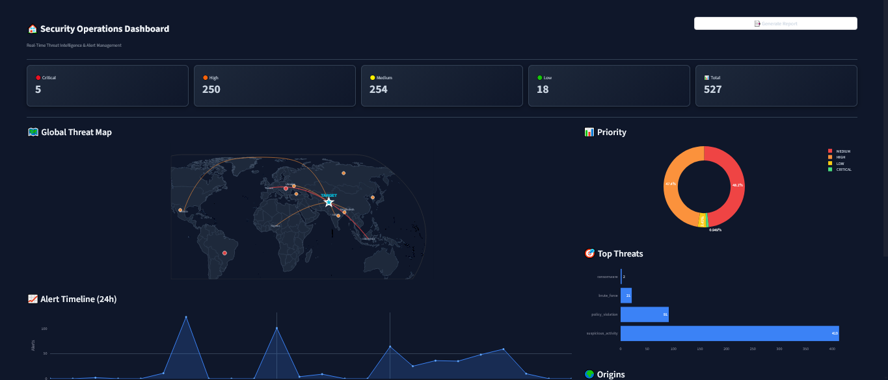
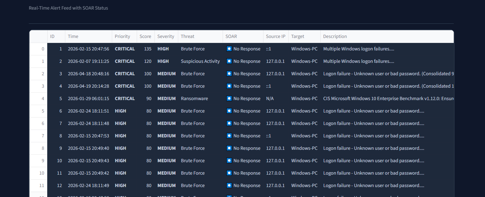
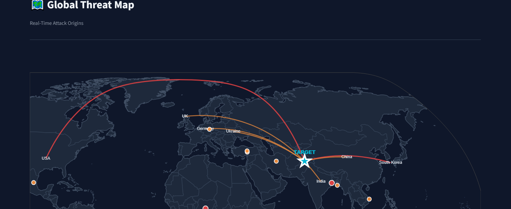
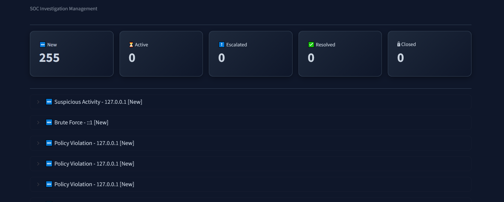
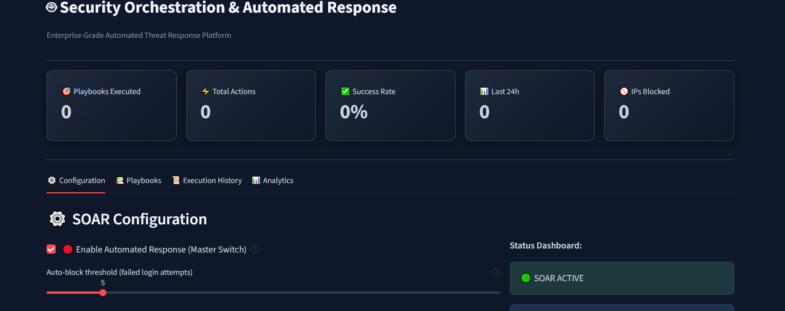
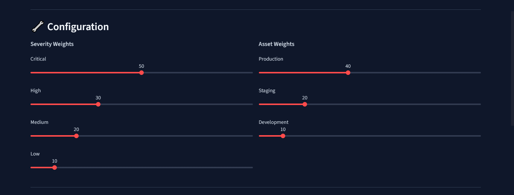
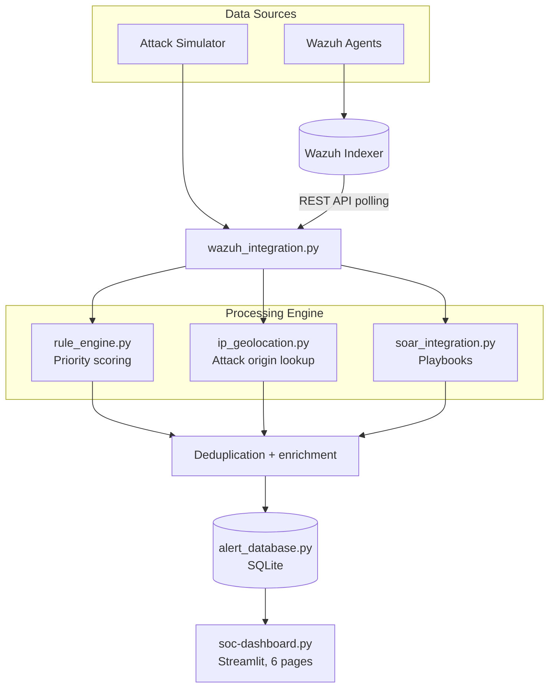

<div align="center">

# 🛡️ AI-Driven SOC Alert Triage & Prioritization System

**Turn a flood of SIEM alerts into a short, explainable, prioritized queue, with automated response playbooks.**


*Final Year Project · BS Computer Science · Aug 2026*



</div>

---

## 📌 The Problem

Security Operations Centers drown in alerts. Most of them are duplicates, noise or low-priority events, which leads to **alert fatigue**, slow response, and a real risk that a critical threat gets buried.

Commercial platforms (Splunk ES, IBM QRadar) solve this with expensive licenses. **Wazuh** is free, but it does not prioritize, deduplicate or automate response out of the box.

## 💡 The Solution

This project adds an **explainable triage and SOAR layer on top of Wazuh**, using only free and open-source components:

- 🎯 **Priority scoring** that ranks every alert Critical / High / Medium / Low, with the exact point breakdown shown to the analyst
- 🧹 **Smart deduplication** that merges related alerts inside a 10-minute window
- 🤖 **SOAR playbooks** that respond automatically to common attack types
- 🌍 **IP geolocation** and a live global threat map
- 🕵️ **Investigation workflow** with a 5-stage case lifecycle
- ⚙️ **No-code tuning** of scoring weights from the dashboard

> The scoring is deliberately **rule-based, not a black-box ML model**, so every decision can be explained to an analyst.

---

## 🖼️ Screenshots

<table>
  <tr>
    <td width="50%"><br><sub><b>Real-time alert feed</b>: priority, score, SOAR status, consolidated alerts</sub></td>
    <td width="50%"><br><sub><b>Global threat map</b>: attack origins via IP geolocation</sub></td>
  </tr>
  <tr>
    <td width="50%"><br><sub><b>Investigation management</b>: New → Active → Escalated → Resolved → Closed</sub></td>
    <td width="50%"><br><sub><b>SOAR control panel</b>: master switch, auto-block threshold, playbooks</sub></td>
  </tr>
  <tr>
    <td colspan="2" align="center"><br><sub><b>Rule engine configuration</b>: adjust severity and asset weights with sliders, no code changes</sub></td>
  </tr>
</table>

---

## 🏗️ Architecture



| Module | Responsibility |
|---|---|
| `wazuh_integration.py` | Securely polls the Wazuh Indexer, groups similar alerts, maps severity and threat type |
| `rule_engine.py` | Weighted, explainable priority scoring |
| `ip_geolocation.py` | Resolves source IPs to countries for the threat map |
| `soar_integration.py` | Declarative playbooks (trigger + ordered actions) and the execution engine |
| `alert_database.py` | SQLite persistence for alerts, investigations and SOAR history |
| `alert_simulator.py` | Generates realistic synthetic alerts for repeatable testing |
| `soc-dashboard.py` | Six-page Streamlit analyst interface |

---

## 🎯 How Scoring Works

```
Priority Score = Severity points + Asset points + Threat-indicator points
```

| Severity | Pts | Asset | Pts | Threat indicator | Pts |
|---|---|---|---|---|---|
| Critical | 50 | Production | 40 | Known malicious IP | +20 |
| High | 30 | Staging | 20 | Brute force (≥ 5 failures) | +15 |
| Medium | 20 | Development | 10 | Malware detected | +25 |
| Low | 10 | | | Ransomware | +30 |

| Score | Priority |
|---|---|
| 80+ | 🔴 CRITICAL |
| 60–79 | 🟠 HIGH |
| 40–59 | 🟡 MEDIUM |
| 0–39 | 🟢 LOW |

**Worked example (brute force):** High (30) + Production (40) + malicious IP (+20) + 10 failed attempts (+15) = **105 → CRITICAL**.
Every score is stored with the list of reasons that produced it, so analysts see *why*, not just *what*.

## 🤖 SOAR Playbooks

Six playbooks are defined declaratively (trigger conditions plus ordered actions), so new ones can be added without touching the engine:

`Brute Force` · `Malware Infection` · `Ransomware Emergency` · `Suspicious Activity` · `Policy Violation` · `DoS Attack`

Together they cover **12 action types**: block IP, isolate host, disable user, kill process, create ticket, send notification, log event, disable network shares, snapshot system, emergency broadcast, collect logs, block outbound traffic.

> ℹ️ Action handlers are currently **simulated** (no real firewall or EDR calls). Real integrations are on the roadmap.

---

## 📊 Results (live Wazuh deployment)

Evaluated on real alert data from a running Wazuh environment, not only synthetic tests:

| Metric | Result |
|---|---|
| Alerts processed | **527** |
| Critical / High / Medium / Low | **5 / 250 / 254 / 18** |
| Dominant category | Suspicious activity (413 alerts, about 78%) |
| Deduplication | Repeated logon failures merged into single entries (e.g. "Consolidated 9") |

### Comparison

| Feature | Splunk ES | IBM QRadar | Wazuh (base) | **This project** |
|---|---|---|---|---|
| Alert prioritization | Manual / search-based | Correlation-based | None | **Automated, explainable** |
| Deduplication | Limited | Offense grouping | None | **10-min temporal** |
| SOAR automation | Paid add-on | Limited | None | **6 built-in playbooks** |
| Geographic mapping | Add-on | Add-on | None | **Built-in** |
| Cost | High | High | Free | **Free (open-source stack)** |

*This project does not try to match Splunk or QRadar in raw correlation depth. It targets the gap of affordable, explainable prioritization and automation on top of an open-source SIEM.*

---

## 🚀 Quick Start

**Prerequisites:** Docker Desktop, Python 3.10+, Git

### 1. Clone

```bash
git clone https://github.com/AhtishamTanveer/FYP-Project.git
cd FYP-Project
```

### 2. Start Wazuh (Docker)

```bash
cd wazuh-docker/single-node
docker compose -f generate-indexer-certs.yml run --rm generator
docker compose up -d
```

Wait a few minutes. The Wazuh dashboard is then available at `https://localhost`.

### 3. Configure credentials

```bash
cd ../../SOC-Alert-Triage
copy .env.example .env        # Windows   (Linux/macOS: cp .env.example .env)
```

Open `.env` and fill in your Wazuh passwords. **Never commit this file** (it is git-ignored).

### 4. Install and run

```bash
python -m venv venv
venv\Scripts\activate          # Linux/macOS: source venv/bin/activate
pip install -r requirements.txt

python wazuh_test.py           # verifies Indexer + Manager API connectivity
python -m streamlit run soc-dashboard.py
```

---

## 🔐 Security Practices

- Credentials live only in `.env` (git-ignored); `.env.example` documents every variable
- HTTPS is mandatory for Wazuh connections
- TLS is configurable: trust a custom CA (`WAZUH_CA_CERT`), full verification, or lab-only mode with an explicit warning
- Passwords and tokens are never printed or logged
- Config values (lookback window, result size, IPs) are validated before use

---

## ⚠️ Known Limitations & Roadmap

Honest notes from the evaluation:

- [ ] Scores can exceed the intended 100 cap (observed up to 135); the cap is to be enforced
- [ ] SOAR actions are simulated; add real firewall / EDR integrations
- [ ] Persistent long-term SOAR execution history (the panel currently reports a rolling 24 h window)
- [ ] Ground-truth accuracy evaluation against analyst-labelled alerts
- [ ] Optional ML-assisted weight tuning, keeping the rule-based engine as the explainable fallback
- [ ] Multi-tenant / cloud deployment

---

## 📂 Repository Structure

```
FYP-Project/
├── SOC-Alert-Triage/        # Our application code (Python)
│   ├── soc-dashboard.py
│   ├── wazuh_integration.py
│   ├── rule_engine.py
│   ├── soar_integration.py
│   ├── ip_geolocation.py
│   ├── alert_database.py
│   ├── alert_simulator.py
│   ├── .env.example
│   ├── requirements.txt
│   └── LICENSE
├── wazuh-docker/            # Official Wazuh Docker deployment (not our code)
├── docs/screenshots/
└── README.md
```

> `wazuh-docker/` comes from the official [wazuh/wazuh-docker](https://github.com/wazuh/wazuh-docker) repository and is used here to run the SIEM. It keeps its own license. All application logic is in `SOC-Alert-Triage/`.

---

## 👥 Team

| | |
|---|---|
| **Ahtisham Tanveer** | [GitHub](https://github.com/AhtishamTanveer) < https://www.linkedin.com/in/ahtisham-tanveer-0b36b0316/  |
| **Supervisor** | Mr. Wasiq Aslam, Assistant Lecturer |

*BS Computer Science, Department of Computer Science,Muslim Youth University Islamabad, Pakistan, August 2026.*

---

<div align="center">

If you found this project useful, consider giving it a ⭐

</div>
